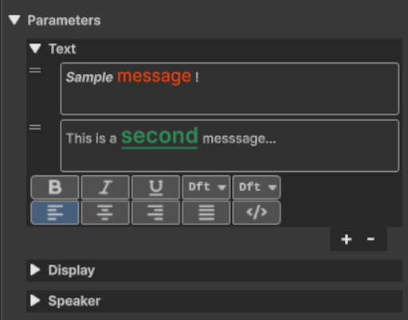
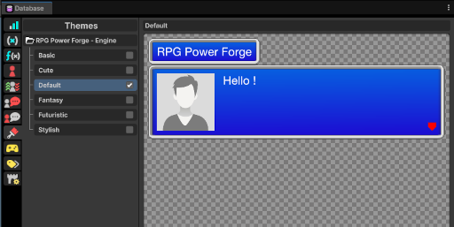
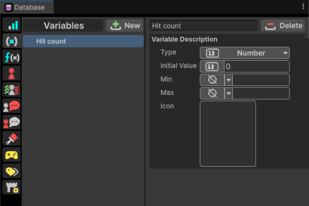
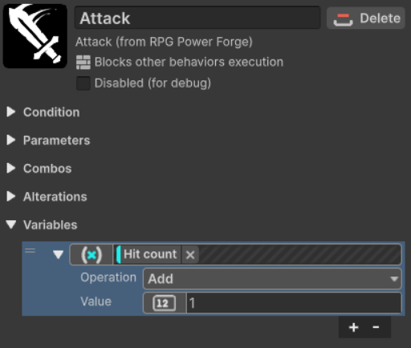
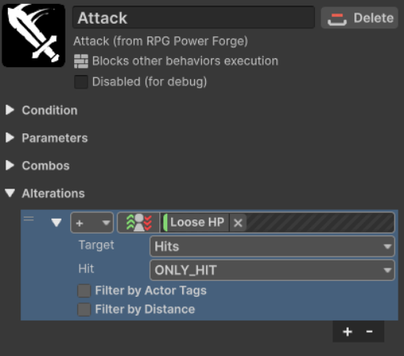
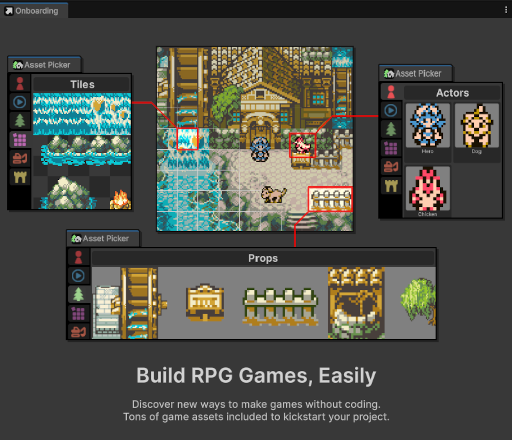
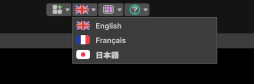
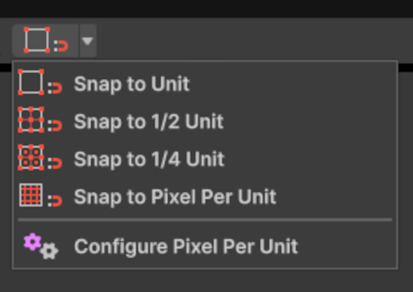
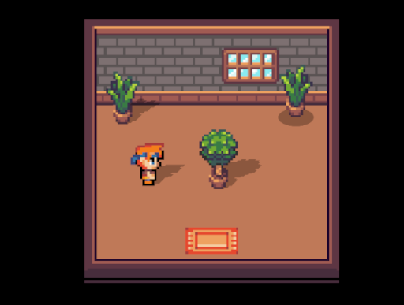

# RPG Power Forge v0.6

## New features
We are happy to finally present the new features included in this version. Take a minute to see what **RPG Power Forge v0.6** offers !
### Message box Behavior
  
We are adding a new **Actor Behavior** : **Message Box**  
**Message Box** allows you to display a text message in various configurations ( bubble, big box, with or without animated faceset). You can also chain multiple messages and customise each of them with color, size, etc.  
  
Additionnaly, in the **Database** window, you can configure different **UI Themes** to apply to your game. You can add you own **Themes** (using the Unity USS langage).
  
### Database window 
  
The **Database** window holds all of the informations of your game. You'll be able to set your **Actors**, **Variables**, **Stats**, etc. 
### Variables
  
You can now modify a **Variable** when a **Bahavior** is triggered.
### Alteration
  
**Alteration** is our solution to apply a modification to an Actor during the game. It is applied when a **Behavior** is triggered. An **Alteration** can affect an **Actor** in various ways : add/substract a **Stat**, apply a temporary status, etc.
### Onboarding
  
Once you've installed **RPG Power Forge**, you'll be welcomed !
### News
This very window is remotely updated, which make if possible for us to inform you in real-time !
### Localization
  
English, French and Japanese (partial) are available !
### Quality of life
  
You can now easily snap **Props** and **Actors** on you scene using our snap feature (available in the **Asset Picker** Toolbar)  
  
**Props** and **Actors** can now have a shadow casted ! You can choose between a projected shadow or a blob one (disk).

